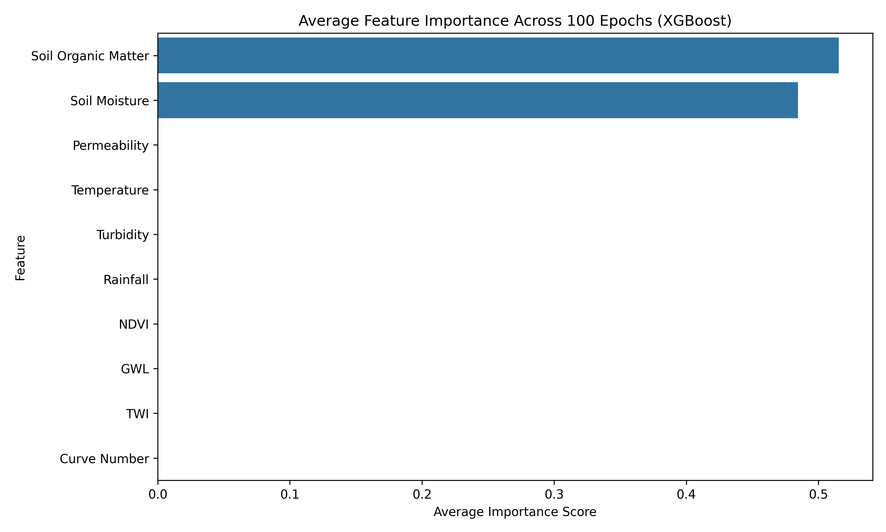
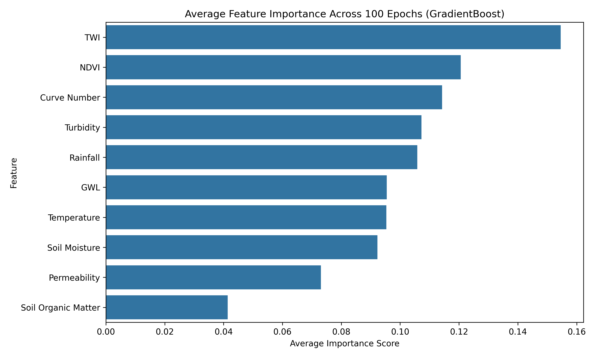
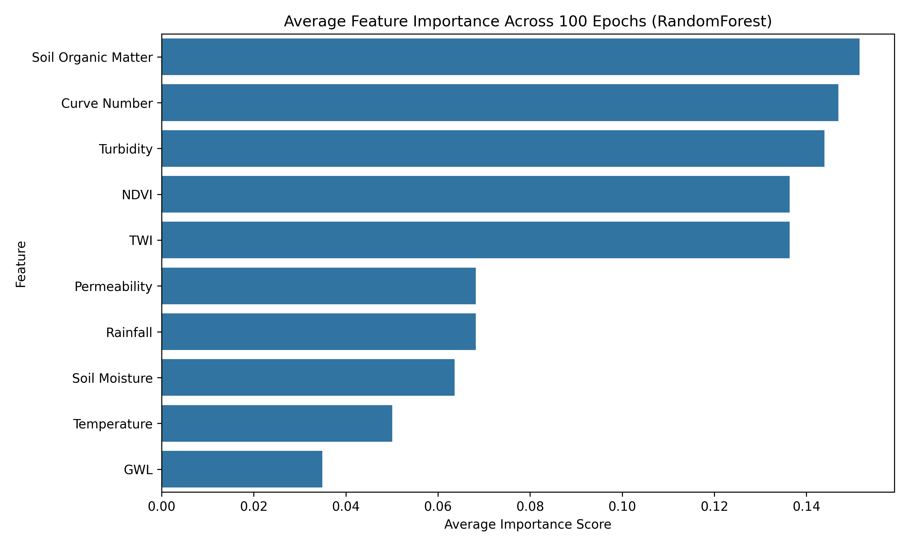

# Pond Recharge Modeling Framework

## Overview

This repository provides a computational framework for basin-scale estimation of pond-based groundwater recharge using multi-source geospatial data and machine learning models.

The framework is developed for the Ramganga Basin (India) and integrates:
- Pond inventory from field surveys, government datasets, and remote sensing
- Hydro-environmental predictors (10 thematic layers)
- Statistical and machine learning models for recharge estimation
- Spatial mapping of recharge potential zones

This repository supports the study:

**“A Computational Framework for Basin-Scale Pond Recharge Estimation Using Multi-Source Geospatial Data”**

---

## Study Workflow

The computational framework consists of four major steps:

1. **Pond Inventory Development**
   - Integration of MGNREGA, Amrit Sarovar, remote sensing (NDPI, NDWI), and field validation
   - Total 7,443 ponds mapped across the basin

2. **Preparation of Recharge Determining Factors**
   - 10 predictors used:
     - Soil Moisture
     - Permeability
     - Rainfall
     - Groundwater Level
     - Soil Organic Matter
     - Land Surface Temperature
     - Turbidity Index
     - Topographic Wetness Index (TWI)
     - NDVI
     - Curve Number

3. **Model Development**
   - Statistical models:
     - Frequency Ratio (FR)
     - Weight of Evidence (WOE)
     - Shannon Entropy (SE)
   - Machine learning models:
     - Random Forest (RF)
     - XGBoost (XGB)
     - Gradient Boosting (GB)

4. **Validation and Mapping**
   - Validation using 23 monitoring sites (WLF method)
   - AUC-based classification and regression validation
   - Basin-scale recharge mapping

---

## Repository Structure

- `GEE_scripts/`
  Google Earth Engine scripts for pond extraction and geospatial data processing

- `python_scripts/scripts/`
  Python scripts for:
  - raster preprocessing
  - KDE analysis
  - correlation analysis
  - machine learning modeling

- `Recharge_Factors/`
  Processed geospatial predictor datasets used in modeling

- `Pond_Points/`
  Pond location dataset

- `Pond_Shape/`
  Pond polygon dataset

- `example_data/`
  Minimal working dataset for testing the workflow

- `example_output/`
  Output generated from example run

---

## Software Requirements

The workflow uses open-source tools:

- Python (>= 3.8)
- Google Earth Engine (GEE)
- pandas
- numpy
- matplotlib
- scikit-learn
- xgboost
- rasterio
- geopandas

Install dependencies:

```bash
pip install -r requirements.txt
```

## Instructions to Run Script

### GEE_scripts

Step 1: Open Google Earth Engine (https://code.earthengine.google.com/)  
Step 2: Copy scripts from the GEE_scripts folder  
Step 3: Run the scripts to generate geospatial layers  
Step 4: Export outputs for further analysis  

### python_scripts/scripts/

Step 1: Install required packages  
pip install -r requirements.txt  

Step 2: Run the model script  
py python_scripts/scripts/ml_models_recharge.py  

Step 3: Output files will be generated in the example_output/ folder  

## Example Results

The following figures demonstrate the outputs generated using the example dataset:

### Figure 1: XGBoost average feature importance  


### Figure 2: Gradient Boosting average feature importance  


### Figure 3: Random Forest average feature importance  
